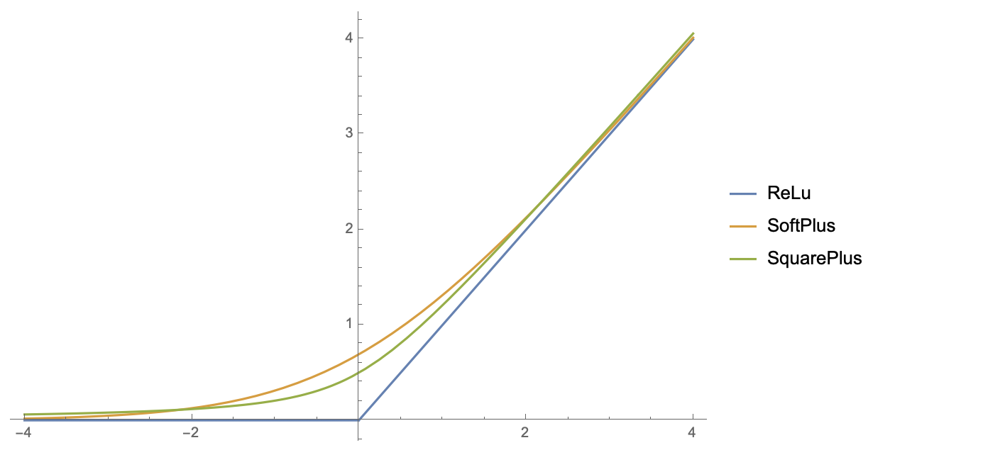
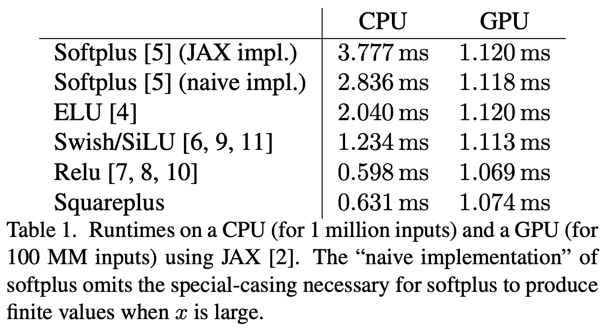

# SquarePlus (Pytorch implement)

unofficial pytorch implement of ["Squareplus: A Softplus-Like Algebraic Rectifier"](https://arxiv.org/abs/2112.11687)


## SquarePlus

Squareplus is a Softplus-Like activation function. It is a very simple smooth approximation of ReLU.

The form of squareplus is very simple. It only uses addition, multiplication, division and square root:

$\text{SquarePlus}(x)=\frac{x+\sqrt{x^2+b}}{2}$

b>0 in this form. When b=0, it degenerates to$\text{ReLU}(x)=max(x,0)$



The original paper pointed out that since only addition, multiplication, division and square root are used, the speed of squareplus (mainly on the CPU) will be faster than SoftPlus and other functions.



In [jianlin su's blog](https://kexue.fm/archives/8833), it is pointed out that when b=1.52382103⋯, this function is closest to SoftPlus. The solution process is as follows:

```python
import numpy as np
from scipy.special import erf
from scipy.optimize import minimize

def f(x, a):
    return np.abs((x + np.sqrt(x**2 + a**2)) / 2 - np.log(np.exp(x) + 1))

def g(a):
    return np.max([f(x, a) for x in np.arange(-2, 4, 0.0001)])

options = {'xtol': 1e-10, 'ftol': 1e-10, 'maxiter': 100000}
result = minimize(g, 0, method='Powell', options=options)
b = result.x**2
print(b)
```
